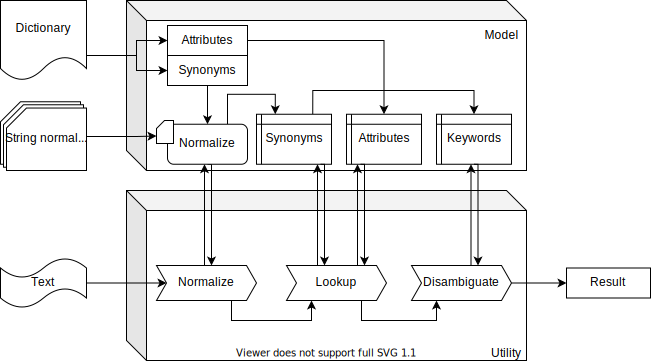

# pilsner

Python implemented library servicing named entity recognition

[![pypi][pypi-img]][pypi-url]

[pypi-img]: https://img.shields.io/pypi/v/pilsner?style=plastic
[pypi-url]: https://pypi.org/project/pilsner/

## 1. Purpose

This library is Python implementation of toolkit for dictionary based named entity recognition. It is intended to store any thesaurus in a trie-like structure and identify any of stored synonyms in a string.

## 2. Installation and dependencies

```bash
pip install pilsner
```

`pilsner` is tested in Python 3.6, 3.7, and 3.8.

The only dependency is `sic` package. While it can be automatically installed at the time of `pilsner` installation, manual installation of `sic` beforehand might also be considered (see benchmark of cythonized vs pure Python implementation in `sic` docimentation, [https://pypi.org/project/sic/](https://pypi.org/project/sic/)).

## 3. Diagram

`pilsner` consists of two major components: `Model` and `Recognizer`. `Model` class provides storage for the dictionary and string normalization rules, as well as methods for populating this storage. `Recognizer` class provides methods for accessing `Model`.



## 4. Usage

```python
import pilsner
```

```python
import pilsner

m = pilsner.Model()
m.add_normalizer('default', 'default_normalizer.xml')
m.add_normalizer('custom', 'custom_normalizer.xml')
m.normalizer_map = {
    'animal': 'default',
    'plant': 'custom'
}
r = pilsner.Recognizer()
fields = [
    {
        'name': 'type',
        'include': True,
        'delimiter': None,
        'id_flag': False,
        'normalizer_flag': True,
        'value_flag': False
    },
    {
        'name': 'id',
        'include': True,
        'delimiter': None,
        'id_flag': True,
        'normalizer_flag': False,
        'value_flag': False
    },
    {
        'name': 'label',
        'include': True,
        'delimiter': None,
        'id_flag': False,
        'normalizer_flag': False,
        'value_flag': True
    },
    {
        'name': 'habitat',
        'include': True,
        'delimiter': ',',
        'id_flag': False,
        'normalizer_flag': False,
        'value_flag': False
    }
]
specs = r.compile_dict_specs(fields)
r.compile_model(
    model=m,
    filename='living_things.txt',
    specs=specs,
    word_separator=' ',
    column_separator='\t',
    column_enclosure='\n',
    include_keywords=True
)
m.save('living_things')
m = pilsner.Model('living_things')
text_to_parse = 'sample text here'
parsed = r.parse(
    model=m,
    source_string=text_to_parse,
    attrs_where={
        '+': {'habitat': {'air', 'ocean'}}
    },
    attrs_out=['id', 'type', 'habitat']
)
```

### 4.1. Initialize model

- To initialize empty model:

```python
m = pilsner.Model()
```

- To specify path to temporary database for empty model:

```python
# For temporary database to be created on disk:
m = pilsner.Model(storage_location='path/to/database.file')

# For temporary database to be created in memory:
m = pilsner.Model(storage_location=':memory:')
```

> If database is created in memory, the model cannot be later saved on disk (can only be used instantly).

- To load model from disk:

```python
m = pilsner.Model(filename='path/to/model')
```

> More on how model is loaded from disk - see [4.7. Load model](#47-load-model).

### 4.2. Add string normalization units

String normalization is technically done by `sic` component.

### 4.3. Add dictionary

Blah

### 4.4. Initialize utility

```python
r = pilsner.Recognizer()
```

### 4.5. Compile model

Blah

### 4.6. Save model

Blah

### 4.7. Load model

Blah

### 4.8. Parse string

Blah

## 5. Example

Blah
